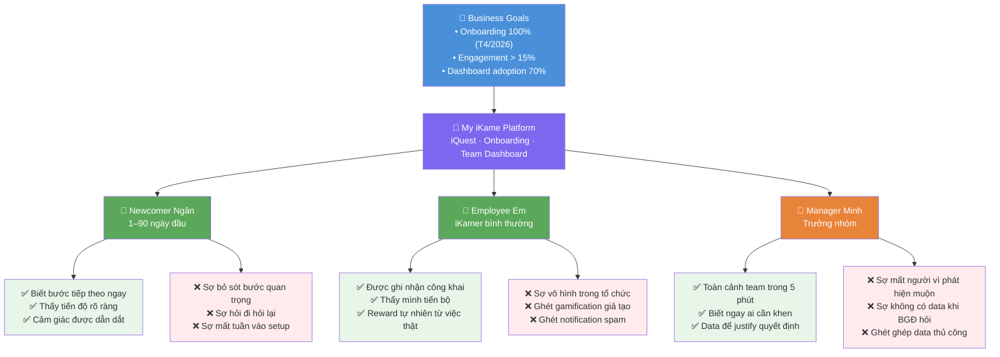

# Trigger Map: My iKame — 3 Core Features

**Created:** 2026-03-30
**Phase:** 2 — Trigger Map
**Agent:** Saga (Analyst)
**Workshop Mode:** Ngày 2026-03-30 với Dung Nguyen Viet

---

## Documents

| # | Document | Purpose | Status |
|---|----------|---------|--------|
| 01 | [Business Goals](01-business-goals.md) | Vision, SMART objectives, prioritization | ✅ Complete |
| 02 | [Newcomer Ngân](02-newcomer-ngan.md) | Persona — Nhân sự mới (Onboarding) | ✅ Complete |
| 03 | [Employee Em](03-employee-em.md) | Persona — iKamer đang làm việc (iQuest) | ✅ Complete |
| 04 | [Manager Minh](04-manager-minh.md) | Persona — Trưởng nhóm (Team Dashboard) | ✅ Complete |

---

## Trigger Map Visualization



---

## Strategic Focus

**Priority 1 Goal:** Onboarding 100% trước T4/2026
**Priority 1 User:** Newcomer Ngân
**Priority 1 Drivers:**
- Biết ngay bước tiếp theo (không phải đoán)
- Tiến độ visible có thể nhìn thấy
- Không sợ bỏ sót bước quan trọng

**Priority 2 Goal:** Team Dashboard adoption — BGĐ priority
**Priority 2 User:** Manager Minh
**Priority 2 Drivers:**
- Scan toàn cảnh team trong < 5 phút
- Phát hiện disengagement trước khi muộn
- Data có sẵn khi BGĐ hỏi

**Shared Infrastructure:** iQuest phục vụ cả Ngân (onboarding sequence) lẫn Em (engagement) lẫn Minh (behavior data source)

---

## Vòng lặp giá trị

```
Newcomer Ngân hoàn thành Onboarding qua iQuest
    ↓ trở thành
Employee Em dùng iQuest trong công việc hàng ngày
    ↓ tạo ra
Behavior data feed vào Team Dashboard
    ↓ giúp
Manager Minh khen đúng người, phát hiện risk sớm
    ↓ tạo ra
Môi trường được ghi nhận → Em gắn kết hơn
    ↓ quay lại
Engagement tăng → data phong phú hơn → Dashboard chính xác hơn
```

---

## Next: Phase 3 — UX Scenarios

Freya sẽ sử dụng Trigger Map này để tạo UX Scenarios cho từng persona:
- **Scenario 1:** Newcomer Ngân — Ngày đầu tiên trên My iKame
- **Scenario 2:** Employee Em — Hoàn thành quest từ hành vi thật
- **Scenario 3:** Manager Minh — Monday morning team check-in

Gọi `/freya` để bắt đầu Phase 3.
